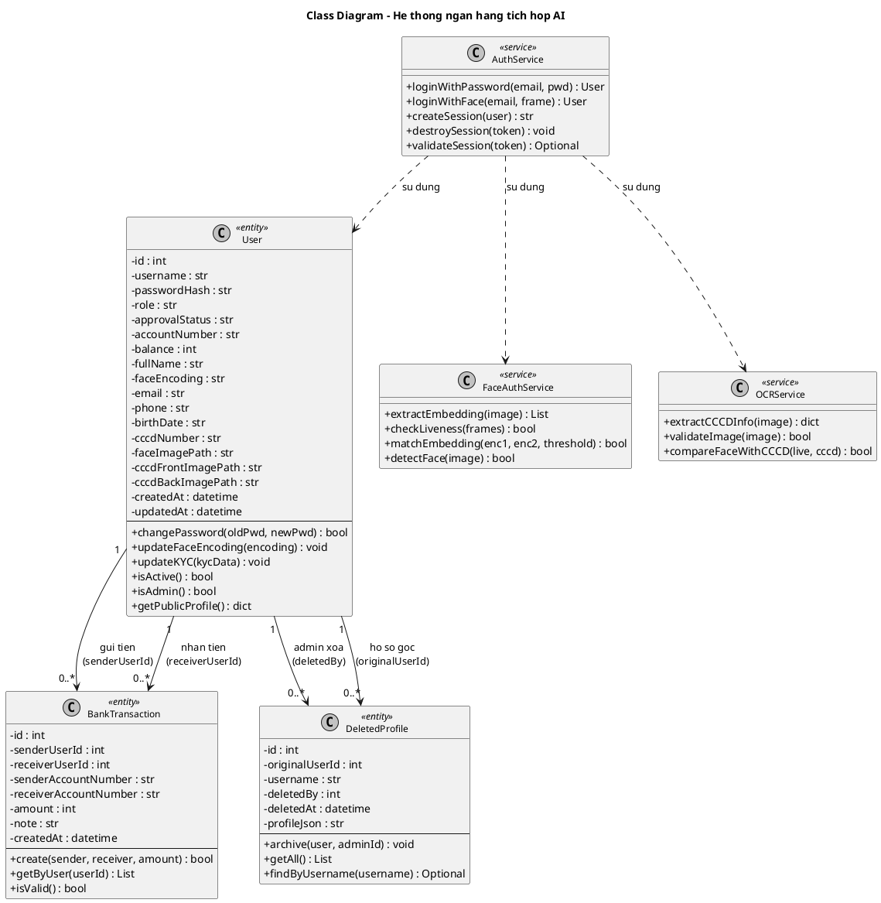

#### 3.2.1 Tổng quan các lớp trong hệ thống

Sơ đồ lớp mô tả cấu trúc tĩnh của hệ thống thông qua các lớp đối tượng, thuộc tính, phương thức và mối quan hệ giữa chúng.
Trong hệ thống ngân hàng tích hợp AI, các lớp được phân thành hai nhóm chính:

1. **Lớp thực thể (Entity Classes):** ánh xạ trực tiếp từ các bảng cơ sở dữ liệu, đại diện cho dữ liệu nghiệp vụ.
2. **Lớp dịch vụ (Service Classes):** đóng gói logic xử lý nghiệp vụ và tích hợp AI, không lưu trữ dữ liệu trực tiếp.

**Bảng 3.4 – Danh sách các lớp chính trong hệ thống**

| STT | Tên lớp         | Loại    | Mô tả                                                      |
| --- | --------------- | ------- | ---------------------------------------------------------- |
| 1   | User            | Entity  | Đại diện tài khoản người dùng hoặc quản trị viên           |
| 2   | BankTransaction | Entity  | Đại diện một giao dịch chuyển khoản nội địa                |
| 3   | DeletedProfile  | Entity  | Lưu trữ hồ sơ đã xóa phục vụ truy vết và kiểm tra          |
| 4   | AuthService     | Service | Xử lý xác thực người dùng và quản lý phiên làm việc        |
| 5   | FaceAuthService | Service | Trích xuất embedding, kiểm tra liveness, so khớp khuôn mặt |
| 6   | OCRService      | Service | Nhận dạng ký tự quang học từ ảnh CCCD                      |

#### 3.2.2 Mô tả chi tiết từng lớp

**Lớp 1: User**

Lớp `User` ánh xạ trực tiếp từ bảng `users` trong cơ sở dữ liệu. Đây là lớp trung tâm của toàn hệ thống, đại diện cho cả hai vai trò người dùng và quản trị viên.

**Bảng 3.5 – Thuộc tính lớp User**

| Thuộc tính         | Kiểu     | Phạm vi | Mô tả                                                |
| ------------------ | -------- | ------- | ---------------------------------------------------- |
| id                 | int      | private | Định danh duy nhất, tự tăng                          |
| username           | str      | private | Tên đăng nhập (duy nhất toàn hệ thống)               |
| passwordHash       | str      | private | Mật khẩu đã băm bằng bcrypt                          |
| role               | str      | private | Vai trò: 'admin' hoặc 'user'                         |
| approvalStatus     | str      | private | Trạng thái: pending / approved / rejected / locked   |
| accountNumber      | str      | private | Số tài khoản ngân hàng (duy nhất)                    |
| balance            | int      | private | Số dư tài khoản hiện tại (đơn vị: VNĐ)               |
| fullName           | str      | private | Họ và tên đầy đủ                                     |
| faceEncoding       | str      | private | Chuỗi JSON chứa vector embedding khuôn mặt 128 chiều |
| email              | str      | private | Địa chỉ email                                        |
| phone              | str      | private | Số điện thoại                                        |
| cccdNumber         | str      | private | Số CCCD / CMND (duy nhất toàn hệ thống)              |
| faceImagePath      | str      | private | Đường dẫn lưu ảnh khuôn mặt                          |
| cccdFrontImagePath | str      | private | Đường dẫn ảnh CCCD mặt trước                         |
| cccdBackImagePath  | str      | private | Đường dẫn ảnh CCCD mặt sau                           |
| createdAt          | datetime | private | Thời điểm tạo tài khoản                              |
| updatedAt          | datetime | private | Thời điểm cập nhật gần nhất                          |

**Bảng 3.6 – Phương thức lớp User**

| Phương thức                          | Kiểu trả về | Mô tả                                                |
| ------------------------------------ | ----------- | ---------------------------------------------------- |
| changePassword(oldPwd, newPwd): bool | bool        | Đổi mật khẩu, xác minh mật khẩu cũ trước khi lưu mới |
| updateFaceEncoding(encoding): void   | void        | Ghi đè embedding khuôn mặt mới                       |
| updateKYC(kycData): void             | void        | Cập nhật thông tin CCCD và các trường KYC            |
| isActive(): bool                     | bool        | Kiểm tra tài khoản có trạng thái `approved`          |
| isAdmin(): bool                      | bool        | Kiểm tra tài khoản có quyền quản trị                 |
| getPublicProfile(): dict             | dict        | Trả về thông tin hồ sơ, loại trừ các trường nhạy cảm |

---

**Lớp 2: BankTransaction**

Lớp `BankTransaction` đại diện cho một giao dịch chuyển khoản đã hoàn thành. Mỗi bản ghi là bất biến sau khi được tạo.

**Bảng 3.7 – Thuộc tính lớp BankTransaction**

| Thuộc tính            | Kiểu     | Phạm vi | Mô tả                                      |
| --------------------- | -------- | ------- | ------------------------------------------ |
| id                    | int      | private | Định danh giao dịch, tự tăng               |
| senderUserId          | int      | private | ID người gửi (FK logic đến User.id)        |
| receiverUserId        | int      | private | ID người nhận (FK logic đến User.id)       |
| senderAccountNumber   | str      | private | Số tài khoản nguồn tại thời điểm giao dịch |
| receiverAccountNumber | str      | private | Số tài khoản đích tại thời điểm giao dịch  |
| amount                | int      | private | Số tiền giao dịch (phải > 0, đơn vị: VNĐ)  |
| note                  | str      | private | Nội dung / lý do chuyển khoản              |
| createdAt             | datetime | private | Thời điểm thực hiện giao dịch              |

**Bảng 3.8 – Phương thức lớp BankTransaction**

| Phương thức                              | Kiểu trả về | Mô tả                                            |
| ---------------------------------------- | ----------- | ------------------------------------------------ |
| create(sender, receiver, amount): bool   | bool        | Tạo giao dịch mới, kiểm tra số dư trước khi ghi  |
| getByUser(userId): List[BankTransaction] | list        | Lấy toàn bộ giao dịch liên quan đến tài khoản    |
| isValid(): bool                          | bool        | Kiểm tra tính hợp lệ: amount > 0, hai bên hợp lệ |

---

**Lớp 3: DeletedProfile**

Lớp `DeletedProfile` lưu bản sao đóng băng của hồ sơ tại thời điểm xóa, phục vụ kiểm tra và đối soát sau này.

**Bảng 3.9 – Thuộc tính lớp DeletedProfile**

| Thuộc tính     | Kiểu     | Phạm vi | Mô tả                                         |
| -------------- | -------- | ------- | --------------------------------------------- |
| id             | int      | private | Định danh bản ghi archive, tự tăng            |
| originalUserId | int      | private | ID người dùng gốc (FK logic đến User.id)      |
| username       | str      | private | Username của tài khoản đã xóa                 |
| deletedBy      | int      | private | ID admin thực hiện xóa (FK logic đến User.id) |
| deletedAt      | datetime | private | Thời điểm xóa                                 |
| profileJson    | str      | private | Toàn bộ hồ sơ dưới dạng chuỗi JSON snapshot   |

**Bảng 3.10 – Phương thức lớp DeletedProfile**

| Phương thức                        | Kiểu trả về | Mô tả                                       |
| ---------------------------------- | ----------- | ------------------------------------------- |
| archive(user, adminId): void       | void        | Tạo bản sao lưu hồ sơ trước khi xóa bản gốc |
| getAll(): List[DeletedProfile]     | list        | Lấy toàn bộ danh sách hồ sơ đã xóa          |
| findByUsername(username): Optional | optional    | Tìm kiếm hồ sơ archive theo tên đăng nhập   |

---

**Lớp 4: AuthService**

Lớp `AuthService` là điểm vào chính cho toàn bộ luồng xác thực, điều phối các lớp dịch vụ bên dưới.

**Bảng 3.11 – Phương thức lớp AuthService**

| Phương thức                            | Kiểu trả về    | Mô tả                                                  |
| -------------------------------------- | -------------- | ------------------------------------------------------ |
| loginWithPassword(email, pwd): User    | User           | Xác thực bằng email và mật khẩu, trả về đối tượng User |
| loginWithFace(email, frame): User      | User           | Xác thực bằng khuôn mặt, gọi FaceAuthService           |
| createSession(user): str               | str            | Tạo phiên làm việc, trả về session token               |
| destroySession(token): void            | void           | Hủy phiên khi người dùng đăng xuất                     |
| validateSession(token): Optional[User] | Optional[User] | Kiểm tra phiên hợp lệ, trả về User nếu còn hiệu lực    |

---

**Lớp 5: FaceAuthService**

Lớp `FaceAuthService` bao gói toàn bộ logic nhận diện khuôn mặt, sử dụng thư viện `face_recognition` và `OpenCV`.

**Bảng 3.12 – Phương thức lớp FaceAuthService**

| Phương thức                           | Kiểu trả về | Mô tả                                               |
| ------------------------------------- | ----------- | --------------------------------------------------- |
| extractEmbedding(image): List[float]  | List[float] | Trích xuất vector đặc trưng 128 chiều từ ảnh        |
| checkLiveness(frames): bool           | bool        | Xác nhận người thật qua phân tích chuyển động frame |
| matchEmbedding(enc1, enc2, thr): bool | bool        | So sánh hai embedding theo ngưỡng khoảng cách       |
| detectFace(image): bool               | bool        | Kiểm tra có phát hiện ít nhất một khuôn mặt         |

---

**Lớp 6: OCRService**

Lớp `OCRService` xử lý nhận dạng ký tự quang học từ ảnh CCCD, sử dụng EasyOCR hoặc Google Vision API.

**Bảng 3.13 – Phương thức lớp OCRService**

| Phương thức                           | Kiểu trả về | Mô tả                                           |
| ------------------------------------- | ----------- | ----------------------------------------------- |
| extractCCCDInfo(image): dict          | dict        | Trích xuất số CCCD, họ tên, ngày sinh, địa chỉ  |
| validateImage(image): bool            | bool        | Kiểm tra chất lượng và định dạng ảnh hợp lệ     |
| compareFaceWithCCCD(live, cccd): bool | bool        | Đối chiếu khuôn mặt chụp live với ảnh trên CCCD |

#### 3.2.3 Sơ đồ lớp dạng văn bản (ASCII)

```text
+-------------------+          +-------------------------+
|   <<entity>>      |          |   <<entity>>            |
|      User         |          |    BankTransaction      |
+-------------------+          +-------------------------+
| -id: int          | 1    0..* | -id: int                |
| -username: str    |---------->| -senderUserId: int      |
| -passwordHash: str| (sender)  | -receiverUserId: int    |
| -role: str        |           | -senderAccountNumber    |
| -approvalStatus   | 1    0..* | -receiverAccountNumber  |
| -accountNumber    |---------->| -amount: int            |
| -balance: int     | (receiver)| -note: str              |
| -faceEncoding     |           | -createdAt: datetime    |
| -email: str       |           +-------------------------+
| -phone: str       |           | +create(): bool         |
| -cccdNumber: str  |           | +getByUser(): list      |
| -createdAt        |           | +isValid(): bool        |
+-------------------+          +-------------------------+
| +changePassword() |
| +updateFace()     |          +-------------------------+
| +updateKYC()      |          |   <<entity>>            |
| +isActive(): bool |          |    DeletedProfile       |
| +isAdmin(): bool  |          +-------------------------+
| +getPublicProfile |          | -id: int                |
+-------------------+          | -originalUserId: int    |
        | 1                    | -username: str          |
        | 0..* (deletedBy)     | -deletedBy: int         |
        +--------------------->| -deletedAt: datetime    |
        | 1                    | -profileJson: str       |
        | 0..* (originalUserId)+-------------------------+
        +--------------------->| +archive(): void        |
                               | +getAll(): list         |
                               | +findByUsername(): opt  |
                               +-------------------------+

+------------------+   uses   +------------------+   uses   +------------------+
|   <<service>>    |--------->|   <<service>>    |          |   <<service>>    |
|   AuthService    |          | FaceAuthService  |          |   OCRService     |
+------------------+          +------------------+          +------------------+
|+loginPassword()  |          |+extractEmbed()   |          |+extractCCCD()    |
|+loginFace()      |--------->|+checkLiveness()  |          |+validateImage()  |
|+createSession()  |   uses   |+matchEmbedding() |          |+compareFace()    |
|+destroySession() |          |+detectFace()     |          +------------------+
|+validateSession()|          +------------------+
+------------------+
```

#### 3.2.4 Sơ đồ lớp dạng PlantUML

Đoạn mã PlantUML dưới đây có thể sử dụng trực tiếp với công cụ PlantUML Online hoặc draw.io để sinh sơ đồ chính thức:



#### 3.2.5 Mô tả các mối quan hệ giữa lớp

**Bảng 3.14 – Quan hệ giữa các lớp**

| Lớp nguồn   | Lớp đích        | Kiểu quan hệ | Bội số  | Ghi chú                                                |
| ----------- | --------------- | ------------ | ------- | ------------------------------------------------------ |
| User        | BankTransaction | Association  | 1–0..\* | Một user gửi nhiều giao dịch (qua senderUserId)        |
| User        | BankTransaction | Association  | 1–0..\* | Một user nhận nhiều giao dịch (qua receiverUserId)     |
| User        | DeletedProfile  | Association  | 1–0..\* | Admin có thể xóa nhiều hồ sơ (qua deletedBy)           |
| User        | DeletedProfile  | Association  | 1–0..\* | Tài khoản bị xóa tạo bản ghi lưu (originalUserId)      |
| AuthService | User            | Dependency   | —       | AuthService sử dụng User để xác thực và kiểm tra       |
| AuthService | FaceAuthService | Dependency   | —       | AuthService gọi FaceAuthService khi đăng nhập mặt      |
| AuthService | OCRService      | Dependency   | —       | AuthService gọi OCRService khi người dùng cập nhật KYC |

**Giải thích các loại quan hệ được sử dụng:**

- **Association (liên kết):** Lớp thực thể này tham chiếu đến lớp thực thể kia thông qua trường khóa ngoại logic. Quan hệ tồn tại lâu dài trong suốt vòng đời đối tượng và được lưu trữ trong cơ sở dữ liệu.
- **Dependency (phụ thuộc):** Lớp dịch vụ sử dụng lớp khác trong phạm vi xử lý một nghiệp vụ cụ thể nhưng không duy trì tham chiếu lâu dài. Thể hiện bằng mũi tên đứt nét trong UML.

#### 3.2.6 Nhận xét thiết kế lớp

**Ưu điểm:**

1. Phân tách rõ ràng giữa lớp thực thể và lớp dịch vụ, tuân thủ nguyên tắc Single Responsibility.
2. Các lớp dịch vụ (`FaceAuthService`, `OCRService`) có thể thay thế hoặc nâng cấp độc lập mà không ảnh hưởng đến lớp dữ liệu.
3. `DeletedProfile` tách biệt hoàn toàn khỏi `User`, đảm bảo tính toàn vẹn lịch sử ngay cả khi tài khoản bị xóa.
4. `AuthService` đóng vai trò facade, che giấu sự phức tạp của luồng xác thực đối với phần còn lại của hệ thống.

**Hạn chế:**

1. Chưa có interface hay lớp trừu tượng cho các service, gây khó khăn khi viết unit test độc lập.
2. Lớp `User` đang chứa cả thuộc tính xác thực lẫn thuộc tính KYC; có thể tách thêm lớp `KYCProfile`.
3. Chưa có lớp `Session` riêng biệt để quản lý trạng thái phiên, hiện logic phiên nằm hoàn toàn trong `AuthService`.

**Định hướng cải tiến:**

1. Bổ sung interface `IFaceRecognizer` và `IOCRProvider` để hỗ trợ đổi thư viện AI linh hoạt (Strategy Pattern).
2. Tách lớp `UserProfile` chứa thông tin KYC, giữ `User` chỉ còn các thuộc tính xác thực cốt lõi.
3. Bổ sung lớp `AuditLog` để ghi nhận toàn bộ sự kiện quan trọng trong hệ thống một cách có hệ thống.

### 3.3 Yeu cau phi chuc nang

- Hieu nang
- Bao mat
- Kha nang mo rong
- Kha nang bao tri
